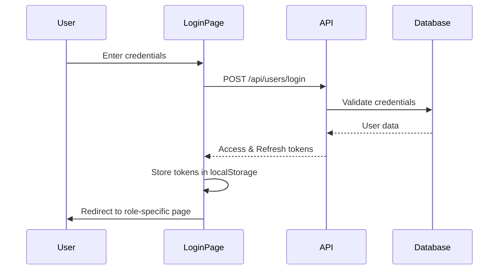

# Authentication Guide

Complete guide to the authentication system in the Meal Planner application.

## Table of Contents

- [Overview](#overview)
- [Login Page](#login-page)
- [Authentication Flow](#authentication-flow)
- [User Roles](#user-roles)
- [API Endpoints](#api-endpoints)
- [Token Management](#token-management)
- [Security Features](#security-features)
- [Usage Examples](#usage-examples)
- [Troubleshooting](#troubleshooting)

## Overview

The Meal Planner System uses JWT (JSON Web Token) based authentication with role-based access control (RBAC). The system supports three user roles: Admin, Caregiver, and Kitchen staff.

### Key Features

- ✅ JWT-based authentication with access and refresh tokens
- ✅ Role-based access control (RBAC)
- ✅ Optional Two-Factor Authentication (2FA)
- ✅ Rate limiting to prevent brute force attacks
- ✅ Secure password hashing with bcrypt
- ✅ Token refresh mechanism
- ✅ Comprehensive audit logging

## Login Page

### Accessing the Login Page

The login page is available at:
```
http://localhost:3000/login
```

You can also access it by clicking the **"Sign In"** button on the home page.

### Login Form Fields

| Field | Type | Required | Description |
|-------|------|----------|-------------|
| Email Address | email | Yes | User's registered email address |
| Password | password | Yes | User's password |

### Demo Credentials

The system comes pre-seeded with three demo accounts:

| Role | Email | Password | Access Level |
|------|-------|----------|--------------|
| **Admin** | admin@example.com | test | Full system access |
| **Caregiver** | caregiver@example.com | test | Meal order management |
| **Kitchen** | kitchen@example.com | test | Kitchen dashboard and preparation |

### User Interface Features

- **Responsive Design**: Works on mobile, tablet, and desktop
- **Dark Mode Support**: Automatically adapts to system theme
- **Error Handling**: Clear error messages for failed login attempts
- **Loading States**: Visual feedback during authentication
- **Accessibility**: WCAG 2.1 Level AA compliant

## Protected Routes

All pages except the home page (`/`) and login page (`/login`) require authentication. Unauthenticated users are automatically redirected to the login page.

### Public Routes

- `/` - Home page (accessible to everyone)
- `/login` - Login page
- `/api-docs` - API documentation (Swagger)
- `/api/swagger.json` - OpenAPI specification

### Protected Routes

All other routes require authentication:
- `/admin` - Admin panel (admin only)
- `/caregiver` - Caregiver interface (caregiver only)
- `/kitchen/dashboard` - Kitchen dashboard (kitchen only)
- `/reports` - Reports (all authenticated users)
- `/audit-logs` - Audit logs (admin only)
- All API endpoints (except login/refresh)

### Middleware Protection

The application uses Next.js middleware to check authentication on every request. If a user tries to access a protected route without being authenticated, they are redirected to `/login` with a `redirect` parameter to return them to their original destination after login.

## Authentication Flow

### 1. User Login



### 2. Token Storage

After successful login, the following data is stored in `localStorage`:

```javascript
localStorage.setItem('accessToken', data.accessToken)
localStorage.setItem('refreshToken', data.refreshToken)
localStorage.setItem('user', JSON.stringify(data.user))
```

### 3. Role-Based Redirection

After login, users are automatically redirected based on their role:

| Role | Redirect URL | Purpose |
|------|--------------|---------|
| Admin | `/admin` | Admin panel for system management |
| Caregiver | `/caregiver` | Meal order creation interface |
| Kitchen | `/kitchen/dashboard` | Kitchen dashboard for meal preparation |

### 4. Token Refresh

Access tokens expire after 15 minutes. The system automatically refreshes them using the refresh token:

```javascript
// Refresh token endpoint
POST /api/users/refresh
Body: { refreshToken: string }
Response: { accessToken: string }
```

### 5. Logout

To logout, call the logout endpoint and clear local storage:

```javascript
POST /api/users/logout
Body: { refreshToken: string }

// Clear local storage
localStorage.removeItem('accessToken')
localStorage.removeItem('refreshToken')
localStorage.removeItem('user')
```

## User Roles

### Admin

**Full system access** with all permissions.

**Capabilities:**
- ✅ Manage users (create, read, update, delete)
- ✅ Manage residents (create, read, update, delete)
- ✅ View all meal orders
- ✅ Access audit logs and versioned records
- ✅ Generate and export reports
- ✅ Configure system settings
- ✅ Access archived data

**Default Credentials:**
- Email: `admin@example.com`
- Password: `test`

### Caregiver

**Meal order management** for residents.

**Capabilities:**
- ✅ View resident information (read-only)
- ✅ Create meal orders for residents
- ✅ Edit pending meal orders (own orders only)
- ✅ View meal orders (own orders or current date)
- ✅ Mark orders as urgent
- ❌ Cannot modify prepared/completed orders
- ❌ Cannot access kitchen dashboard
- ❌ Cannot manage users or residents

**Default Credentials:**
- Email: `caregiver@example.com`
- Password: `test`

### Kitchen

**Meal preparation and ingredient planning**.

**Capabilities:**
- ✅ View resident information (read-only)
- ✅ View all meal orders
- ✅ Update order status (pending → prepared → completed)
- ✅ View kitchen dashboard
- ✅ Generate ingredient aggregation reports
- ✅ Acknowledge alerts
- ❌ Cannot create or delete meal orders
- ❌ Cannot manage users or residents
- ❌ Cannot modify order details (only status)

**Default Credentials:**
- Email: `kitchen@example.com`
- Password: `test`

## API Endpoints

### Authentication Endpoints

#### 1. Login

Authenticate user and receive tokens.

```http
POST /api/users/login
Content-Type: application/json

{
  "email": "admin@example.com",
  "password": "test"
}
```

**Success Response (200):**
```json
{
  "user": {
    "id": "123",
    "email": "admin@example.com",
    "role": "admin",
    "name": "Admin User"
  },
  "accessToken": "eyJhbGciOiJIUzI1NiIsInR5cCI6IkpXVCJ9...",
  "refreshToken": "eyJhbGciOiJIUzI1NiIsInR5cCI6IkpXVCJ9..."
}
```

**Error Response (401):**
```json
{
  "error": "Invalid credentials"
}
```

#### 2. Refresh Token

Exchange refresh token for new access token.

```http
POST /api/users/refresh
Content-Type: application/json

{
  "refreshToken": "eyJhbGciOiJIUzI1NiIsInR5cCI6IkpXVCJ9..."
}
```

**Success Response (200):**
```json
{
  "accessToken": "eyJhbGciOiJIUzI1NiIsInR5cCI6IkpXVCJ9..."
}
```

#### 3. Logout

Invalidate refresh token.

```http
POST /api/users/logout
Content-Type: application/json

{
  "refreshToken": "eyJhbGciOiJIUzI1NiIsInR5cCI6IkpXVCJ9..."
}
```

**Success Response (200):**
```json
{
  "message": "Logged out successfully"
}
```

#### 4. Enable Two-Factor Authentication

Enable 2FA for the authenticated user.

```http
POST /api/users/enable-2fa
Authorization: Bearer <accessToken>
```

**Success Response (200):**
```json
{
  "secret": "JBSWY3DPEHPK3PXP",
  "qrCode": "data:image/png;base64,iVBORw0KGgoAAAANSUhEUgAA..."
}
```

#### 5. Verify Two-Factor Authentication

Verify 2FA code during login.

```http
POST /api/users/verify-2fa
Content-Type: application/json

{
  "userId": "123",
  "token": "123456"
}
```

**Success Response (200):**
```json
{
  "valid": true
}
```

## Token Management

### Access Token

- **Purpose**: Authenticate API requests
- **Expiration**: 15 minutes (configurable via `JWT_ACCESS_TOKEN_EXPIRY`)
- **Storage**: localStorage
- **Usage**: Include in Authorization header

```javascript
fetch('/api/meal-orders', {
  headers: {
    'Authorization': `Bearer ${localStorage.getItem('accessToken')}`
  }
})
```

### Refresh Token

- **Purpose**: Obtain new access tokens
- **Expiration**: 7 days (configurable via `JWT_REFRESH_TOKEN_EXPIRY`)
- **Storage**: localStorage
- **Usage**: Exchange for new access token when expired

### Token Payload

Access tokens contain the following claims:

```json
{
  "userId": "123",
  "email": "admin@example.com",
  "role": "admin",
  "iat": 1234567890,
  "exp": 1234568790
}
```

## Security Features

### 1. Password Hashing

Passwords are hashed using bcrypt with a salt factor of 10:

```javascript
import bcrypt from 'bcrypt'

const hashedPassword = await bcrypt.hash(password, 10)
const isValid = await bcrypt.compare(password, hashedPassword)
```

### 2. Rate Limiting

Login attempts are rate-limited to prevent brute force attacks:

- **Limit**: 5 failed attempts per 15 minutes per IP address
- **Lockout**: Temporary account lockout after exceeding limit
- **Logging**: All failed attempts are logged to audit logs

### 3. JWT Security

- **Secret Key**: Strong secret key stored in environment variables
- **Algorithm**: HS256 (HMAC with SHA-256)
- **Token Rotation**: Refresh tokens are rotated on use
- **Expiration**: Short-lived access tokens (15 minutes)

### 4. Two-Factor Authentication (2FA)

Optional TOTP-based 2FA using Speakeasy:

```javascript
import speakeasy from 'speakeasy'

// Generate secret
const secret = speakeasy.generateSecret({ name: 'Meal Planner' })

// Verify token
const verified = speakeasy.totp.verify({
  secret: secret.base32,
  encoding: 'base32',
  token: userToken
})
```

### 5. Audit Logging

All authentication events are logged:

- ✅ Successful logins
- ✅ Failed login attempts
- ✅ Token refreshes
- ✅ Logouts
- ✅ 2FA events
- ✅ Password changes

## Usage Examples

### Example 1: Basic Login

```javascript
async function login(email, password) {
  try {
    const response = await fetch('/api/users/login', {
      method: 'POST',
      headers: {
        'Content-Type': 'application/json',
      },
      body: JSON.stringify({ email, password }),
    })

    if (!response.ok) {
      throw new Error('Login failed')
    }

    const data = await response.json()
    
    // Store tokens
    localStorage.setItem('accessToken', data.accessToken)
    localStorage.setItem('refreshToken', data.refreshToken)
    localStorage.setItem('user', JSON.stringify(data.user))
    
    return data.user
  } catch (error) {
    console.error('Login error:', error)
    throw error
  }
}
```

### Example 2: Authenticated API Request

```javascript
async function fetchMealOrders() {
  const accessToken = localStorage.getItem('accessToken')
  
  const response = await fetch('/api/meal-orders', {
    headers: {
      'Authorization': `Bearer ${accessToken}`,
      'Content-Type': 'application/json',
    },
  })
  
  if (response.status === 401) {
    // Token expired, refresh it
    await refreshAccessToken()
    return fetchMealOrders() // Retry
  }
  
  return response.json()
}
```

### Example 3: Token Refresh

```javascript
async function refreshAccessToken() {
  const refreshToken = localStorage.getItem('refreshToken')
  
  const response = await fetch('/api/users/refresh', {
    method: 'POST',
    headers: {
      'Content-Type': 'application/json',
    },
    body: JSON.stringify({ refreshToken }),
  })
  
  if (!response.ok) {
    // Refresh token expired, redirect to login
    window.location.href = '/login'
    return
  }
  
  const data = await response.json()
  localStorage.setItem('accessToken', data.accessToken)
}
```

### Example 4: Logout

```javascript
async function logout() {
  const refreshToken = localStorage.getItem('refreshToken')
  
  try {
    await fetch('/api/users/logout', {
      method: 'POST',
      headers: {
        'Content-Type': 'application/json',
      },
      body: JSON.stringify({ refreshToken }),
    })
  } catch (error) {
    console.error('Logout error:', error)
  } finally {
    // Clear local storage
    localStorage.removeItem('accessToken')
    localStorage.removeItem('refreshToken')
    localStorage.removeItem('user')
    
    // Redirect to login
    window.location.href = '/login'
  }
}
```

### Example 5: Protect a Page with AuthGuard

```typescript
'use client'

import AuthGuard from '@/components/AuthGuard'

export default function ProtectedPage() {
  return (
    <AuthGuard allowedRoles={['admin', 'caregiver']}>
      <div>
        <h1>Protected Content</h1>
        <p>Only admin and caregiver can see this</p>
      </div>
    </AuthGuard>
  )
}
```

### Example 6: Use Auth Hook

```typescript
'use client'

import { useRequireAuth } from '@/lib/hooks/useAuth'

export default function MyPage() {
  const { user, loading, logout } = useRequireAuth()

  if (loading) {
    return <div>Loading...</div>
  }

  return (
    <div>
      <h1>Welcome, {user?.name}</h1>
      <p>Role: {user?.role}</p>
      <button onClick={logout}>Logout</button>
    </div>
  )
}
```

### Example 7: Check Authentication Status

```javascript
function isAuthenticated() {
  const accessToken = localStorage.getItem('accessToken')
  const user = localStorage.getItem('user')
  
  return !!(accessToken && user)
}

function getCurrentUser() {
  const userStr = localStorage.getItem('user')
  return userStr ? JSON.parse(userStr) : null
}

function hasRole(role) {
  const user = getCurrentUser()
  return user?.role === role
}
```

## Troubleshooting

### Issue: "Invalid credentials" error

**Cause**: Incorrect email or password.

**Solution**:
1. Verify you're using the correct demo credentials
2. Check for typos in email/password
3. Ensure the database has been seeded: `npm run seed`

### Issue: Login takes very long time (60+ seconds)

**Cause**: Database migrations are running during login, blocking the request.

**Solution**:
1. **Use Payload Admin Panel** (Recommended):
   - Navigate to `http://localhost:3000/admin`
   - Login with demo credentials there first
   - This will complete any pending migrations
   - Then use the custom login page

2. **Alternative - Use Admin Panel Directly**:
   - The Payload admin panel at `/admin` has its own login
   - It handles migrations better
   - Use it for admin tasks

3. **Temporary Workaround**:
   - First login may take 60-90 seconds
   - Subsequent logins will be faster
   - Be patient and wait for the first login to complete

### Issue: Token expired immediately

**Cause**: System clock mismatch or incorrect JWT_SECRET.

**Solution**:
1. Verify system time is correct
2. Check `JWT_SECRET` in `.env` file
3. Restart the server after changing environment variables

### Issue: Cannot access protected routes

**Cause**: Missing or invalid access token.

**Solution**:
1. Check if token exists in localStorage
2. Verify token hasn't expired (15 minutes)
3. Try logging out and logging in again
4. Check browser console for 401 errors

### Issue: Rate limit exceeded

**Cause**: Too many failed login attempts.

**Solution**:
1. Wait 15 minutes before trying again
2. Verify you're using correct credentials
3. Check audit logs for failed attempts: `/audit-logs`

### Issue: 2FA not working

**Cause**: Time synchronization issue or incorrect secret.

**Solution**:
1. Ensure device time is synchronized
2. Verify TOTP app is using correct secret
3. Try regenerating 2FA secret
4. Check that 2FA is enabled for the user

### Issue: Redirect loop after login

**Cause**: Invalid user role or missing redirect logic.

**Solution**:
1. Check user role in database
2. Verify role is one of: admin, caregiver, kitchen
3. Check browser console for errors
4. Clear localStorage and try again

## Environment Variables

Configure authentication behavior with these environment variables:

```env
# Required
JWT_SECRET=your-jwt-secret-here
PAYLOAD_SECRET=your-payload-secret-here

# Optional (with defaults)
JWT_ACCESS_TOKEN_EXPIRY=15m
JWT_REFRESH_TOKEN_EXPIRY=7d
```

### Generating Secrets

```bash
# Generate JWT_SECRET
openssl rand -base64 32

# Generate PAYLOAD_SECRET
openssl rand -base64 32
```

## Best Practices

### For Developers

1. **Never store passwords in plain text**
   - Always use bcrypt for password hashing
   - Use a salt factor of at least 10

2. **Validate tokens on every request**
   - Check token expiration
   - Verify token signature
   - Validate user permissions

3. **Use HTTPS in production**
   - Tokens should only be transmitted over HTTPS
   - Set secure cookie flags

4. **Implement token rotation**
   - Rotate refresh tokens on use
   - Invalidate old tokens

5. **Log security events**
   - Log all authentication attempts
   - Monitor for suspicious activity
   - Alert on multiple failed attempts

### For Users

1. **Use strong passwords**
   - Minimum 8 characters
   - Mix of letters, numbers, and symbols
   - Don't reuse passwords

2. **Enable 2FA**
   - Adds extra layer of security
   - Use authenticator app (Google Authenticator, Authy)

3. **Logout when done**
   - Always logout on shared devices
   - Clear browser data if needed

4. **Keep credentials secure**
   - Don't share login credentials
   - Don't write passwords down
   - Use password manager

## Related Documentation

- [API Documentation](./API_DOCUMENTATION.md) - Complete API reference
- [Swagger API Docs](./SWAGGER_API_DOCS.md) - Interactive API testing
- [Data Models](./DATA_MODELS.md) - Database schema and relationships
- [Testing Strategy](./TESTING_STRATEGY.md) - Authentication testing

## Support

For authentication issues or questions:
- 📧 Email: support@mealplanner.com
- 📚 Documentation: [docs/](../docs/)
- 🐛 Issues: [GitHub Issues](https://github.com/your-repo/issues)

---

**Last Updated**: December 2024  
**Version**: 1.0.0
