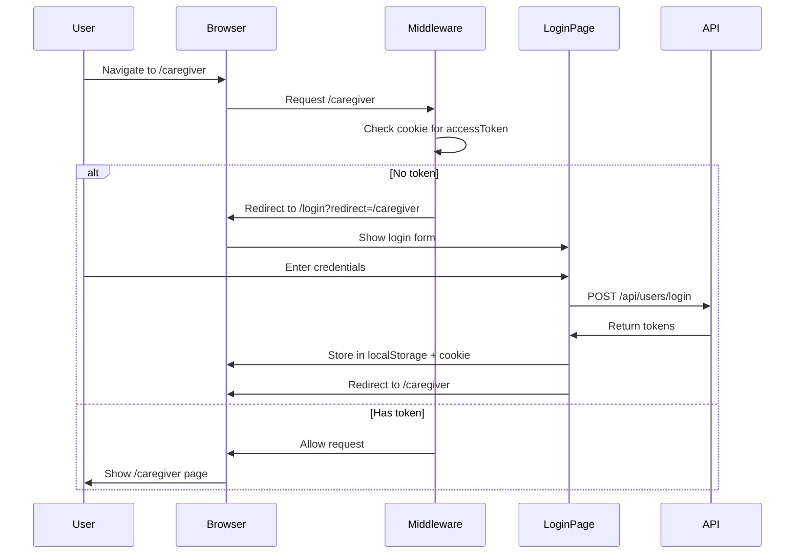
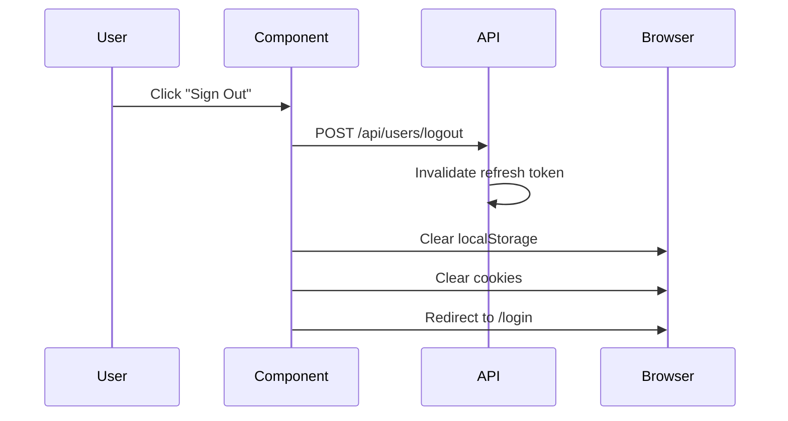

# Authentication Implementation Summary

## Overview

The Meal Planner System now has comprehensive authentication protection across all pages. Unauthenticated users are automatically redirected to the login page.

## What Was Implemented

### 1. Middleware Protection (`middleware.ts`)

A Next.js middleware that runs on every request to check authentication:

- ✅ Checks for access token in cookies
- ✅ Redirects unauthenticated users to `/login`
- ✅ Preserves original URL in `redirect` parameter
- ✅ Allows public routes (home, login, API docs)
- ✅ Protects all other routes automatically

**Public Routes:**
- `/` - Home page
- `/login` - Login page
- `/api-docs` - API documentation
- `/api/swagger.json` - OpenAPI spec
- `/api/users/login` - Login endpoint
- `/api/users/refresh` - Token refresh endpoint

**Protected Routes:**
- Everything else requires authentication

### 2. Enhanced Login Page

Updated login page with:

- ✅ Stores tokens in both localStorage and cookies
- ✅ Handles redirect parameter to return users to original page
- ✅ Quick login buttons for demo accounts
- ✅ Loading states and error handling
- ✅ Dark mode support

### 3. Authentication Hooks

Created reusable hooks for client-side auth:

**`useAuth(requireAuth)`** - Base hook
- Checks localStorage for tokens
- Redirects if not authenticated (when required)
- Returns user data and logout function

**`useRequireAuth()`** - For protected pages
- Automatically redirects if not authenticated
- Returns user, loading state, and logout function

**`useOptionalAuth()`** - For public pages
- Checks auth but doesn't redirect
- Useful for showing different content based on auth status

### 4. AuthGuard Component

A wrapper component for protecting pages:

```typescript
<AuthGuard allowedRoles={['admin', 'caregiver']}>
  <YourProtectedContent />
</AuthGuard>
```

Features:
- ✅ Checks authentication
- ✅ Validates user role
- ✅ Shows loading state
- ✅ Redirects unauthorized users

### 5. Logout Functionality

Created `LogoutButton` component:
- ✅ Calls logout API endpoint
- ✅ Clears localStorage
- ✅ Clears cookies
- ✅ Redirects to login page

### 6. Updated Home Page

Home page now shows different content based on auth status:
- **Not authenticated**: Shows "Sign In" button
- **Authenticated**: Shows user name, role, and "Sign Out" button

## How It Works

### Authentication Flow



### Token Storage

Tokens are stored in two places:

1. **localStorage** - For client-side JavaScript access
   - `accessToken` - JWT access token
   - `refreshToken` - JWT refresh token
   - `user` - User data (JSON)

2. **Cookies** - For middleware access
   - `accessToken` - JWT access token (15 min expiry)
   - HttpOnly: No (needs to be accessible by JS)
   - SameSite: Strict
   - Path: /

### Logout Flow



## Usage Examples

### Protect a Page (Option 1: Using AuthGuard)

```typescript
'use client'

import AuthGuard from '@/components/AuthGuard'

export default function CaregiverPage() {
  return (
    <AuthGuard allowedRoles={['caregiver', 'admin']}></AuthGuard>>
        <h1>Caregiver Dashboard</h1>
        {/* Your content */}
      </div>
    </AuthGuard>
  )
}
```

### Protect a Page (Option 2: Using Hook)

```typescript
'use client'

import { useRequireAuth } from '@/lib/hooks/useAuth'

export default function KitchenPage() {
  const { user, loading, logout } = useRequireAuth()

  if (loading) {
    return <div>Loading...</div>
  }

  return (
    <div>
      <h1>Welcome, {user?.name}</h1>
      <button onClick={logout}>Logout</button>
      {/* Your content */}
    </div>
  )
}
```

### Public Page with Auth-Aware Content

```typescript
'use client'

import { useOptionalAuth } from '@/lib/hooks/useAuth'

export default function HomePage() {
  const { user, logout } = useOptionalAuth()

  return (
    <div>
      {user ? (
        <div>
          <p>Welcome back, {user.name}!</p>
          <button onClick={logout}>Sign Out</button>
        </div>
      ) : (
        <a href="/login">Sign In</a>
      )}
    </div>
  )
}
```

### Add Logout Button to Layout

```typescript
import LogoutButton from '@/components/LogoutButton'

export default function DashboardLayout({ children }) {
  return (
    <div>
      <header>
        <nav>
          {/* Navigation */}
          <LogoutButton />
        </nav>
      </header>
      <main>{children}</main>
    </div>
  )
}
```

## Testing Authentication

### Test Protected Routes

1. **Without Login:**
   - Navigate to `http://localhost:3000/caregiver`
   - Should redirect to `/login?redirect=/caregiver`

2. **With Login:**
   - Login at `/login`
   - Should redirect back to `/caregiver`

3. **After Logout:**
   - Click "Sign Out"
   - Should redirect to `/login`
   - Try accessing `/caregiver` again
   - Should redirect to `/login`

### Test Public Routes

1. **Home Page:**
   - Navigate to `http://localhost:3000/`
   - Should load without redirect
   - Should show "Sign In" button if not authenticated
   - Should show "Sign Out" button if authenticated

2. **API Docs:**
   - Navigate to `http://localhost:3000/api-docs`
   - Should load without authentication

## Security Considerations

### Current Implementation

✅ **Middleware protection** - All routes checked  
✅ **Token in cookies** - Accessible to middleware  
✅ **Token in localStorage** - Accessible to client  
✅ **Redirect preservation** - Users return to original page  
✅ **Role-based access** - Can restrict by role  
✅ **Logout clears everything** - Tokens removed from all storage  

### Production Recommendations

For production deployment, consider:

1. **Use HttpOnly cookies** for refresh tokens
   - More secure (not accessible to JavaScript)
   - Prevents XSS attacks

2. **Enable HTTPS only**
   - Set `Secure` flag on cookies
   - Prevents token theft over HTTP

3. **Implement CSRF protection**
   - Add CSRF tokens to forms
   - Validate on server side

4. **Add token refresh logic**
   - Automatically refresh expired tokens
   - Implement in middleware or API client

5. **Rate limit login attempts**
   - Already implemented in login API
   - Consider adding to middleware

6. **Add session timeout**
   - Auto-logout after inactivity
   - Clear tokens after timeout

## Files Created/Modified

### New Files

- `middleware.ts` - Authentication middleware
- `lib/hooks/useAuth.ts` - Authentication hooks
- `components/AuthGuard.tsx` - Page protection component
- `components/LogoutButton.tsx` - Logout button component
- `docs/AUTHENTICATION_IMPLEMENTATION.md` - This document

### Modified Files

- `app/login/page.tsx` - Added cookie storage and redirect handling
- `app/page.tsx` - Added auth-aware content
- `docs/AUTHENTICATION_GUIDE.md` - Added protected routes section

## Troubleshooting

### Issue: Redirect loop

**Cause**: Token exists but is invalid

**Solution**:
```javascript
// Clear all auth data
localStorage.clear()
document.cookie = 'accessToken=; path=/; max-age=0'
// Refresh page
```

### Issue: Not redirecting after login

**Cause**: Cookie not being set

**Solution**:
- Check browser console for errors
- Verify cookie is set: `document.cookie`
- Check SameSite policy

### Issue: Middleware not running

**Cause**: Route not matched by middleware config

**Solution**:
- Check `middleware.ts` matcher config
- Verify route is not in public routes list

## Next Steps

To further enhance authentication:

1. **Add token refresh** - Automatically refresh expired tokens
2. **Add remember me** - Longer-lived sessions
3. **Add password reset** - Email-based password recovery
4. **Add email verification** - Verify email on signup
5. **Add session management** - View/revoke active sessions
6. **Add audit logging** - Log all auth events

## Conclusion

The authentication system is now fully implemented with:
- ✅ Middleware protection on all routes
- ✅ Automatic redirect to login
- ✅ Redirect back after login
- ✅ Client-side auth hooks
- ✅ Role-based access control
- ✅ Logout functionality
- ✅ Auth-aware UI components

All pages are now protected, and users must authenticate before accessing any protected content.

---

**Status**: ✅ Fully Implemented  
**Last Updated**: December 2024  
**Version**: 1.0.0
